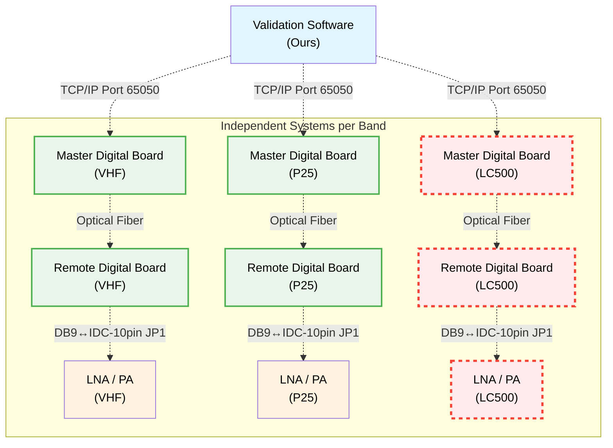
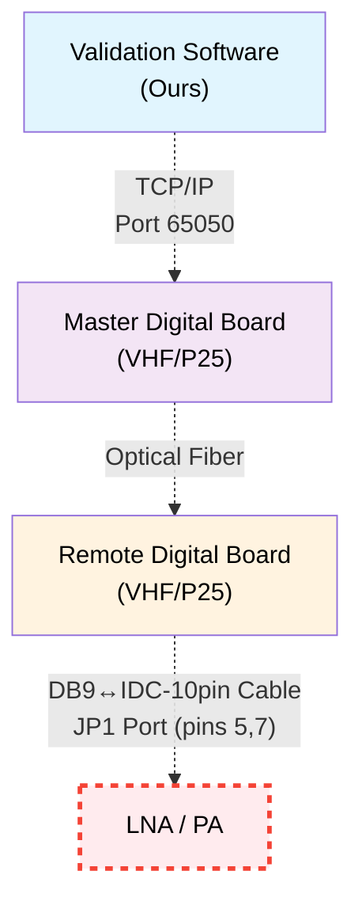
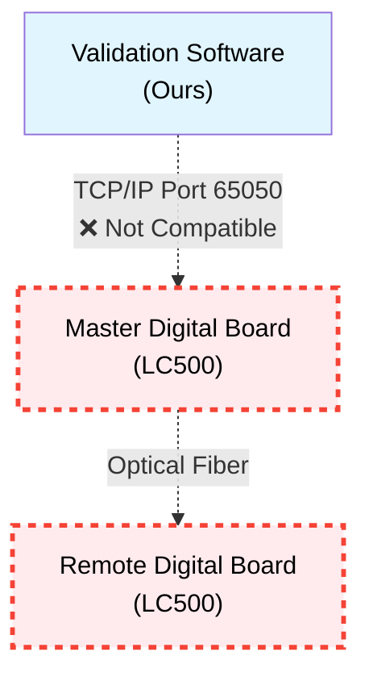
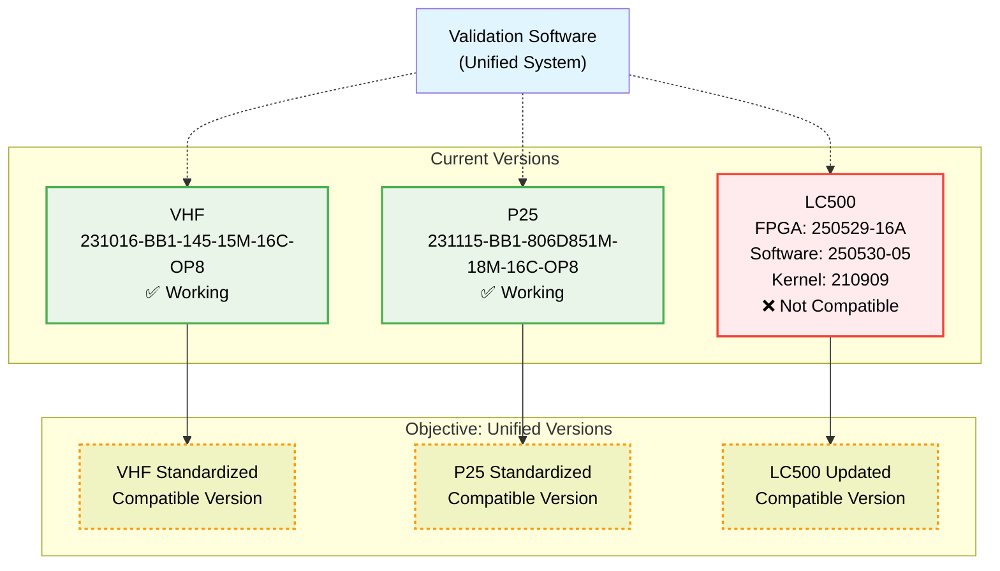

# Technical Questions: Digital Cards Connectivity VHF, P25 and LC500

## System Context

### Architecture

**NOTE**: Each band (VHF, P25, LC500) has its own Master Digital Board and operates as an independent system

### Software Versions
- **VHF**: 231016-BB1-145-15M-16C-OP8 ✅ TCP Compatible
- **P25**: 231115-BB1-806D851M-18M-16C-OP8 ✅ TCP Compatible
- **LC500**: FPGA:250529-16A, Software:250530-05, Kernel:210909 ❌ TCP Not Compatible

### LNA/PA Components
- **Connection**: JP1 port pins 5,7 via DB9↔IDC-10pin cable
- **Problem**: Remote native software does NOT read LNA/PA parameters
- **Objective**: Integrated monitoring via TCP/IP

---

## Technical Questions

### 1. LNA/PA Monitoring

**Problem Architecture:**

**PROBLEM**: Remote native software does NOT read LNA/PA parameters
**OBJECTIVE**: Integrated monitoring via TCP/IP

**Questions:**
- Are there specific commands in "Protocol _TT_2023_8_30.pdf" for LNA and PA?
- Can port 65050 be used to monitor LNA/PA?
- Why doesn't the remote native software read LNA parameters via DB9-IDC 10pin?
- Is it possible to transport LNA/PA commands through: Master → Fiber → Remote → TCP/IP?
- Is special configuration required in master/remote to enable LNA/PA communication?
- Do the VHF/P25 .rar files include monitoring commands for LNA/PA?

### 2. LC500 Compatibility

**Problem Architecture:**

**PROBLEM**: LC500 does not support TCP protocol Port 65050
**OBJECTIVE**: Make LC500 compatible with monitoring system

**Questions:**
- Does LC500 support the same TCP commands as VHF/P25 via optical fiber?
- Is it compatible with port 65050 in master digital board?
- What modifications does LC500 require for TCP compatibility?
- Does LC500 need to be updated to versions compatible with VHF/P25?

### 3. Standardization

**Versions Architecture:**

**PROBLEM**: Different versions complicate maintenance and compatibility
**OBJECTIVE**: Standardize versions for unified monitoring

**Questions:**
- Is it possible to use the same VHF/P25 versions on all cards?
- Would this improve TCP monitoring compatibility?
- Are there technical implications in standardizing versions?

## Required Monitoring Commands (13 TCP commands)
- `temperature` (0x02), `device_id` (0x97), `datt` (0x09)
- `input_and_output_power` (0xF3), `channel_switch` (0x42)
- `channel_frequency_configuration` (0x36), `central_frequency_point` (0xEB)
- `subband_bandwidth` (0xED), `broadband_switching` (0x81)
- `optical_port_switch` (0x91), `optical_port_status` (0x9A)
- `optical_port_devices_connected_1` (0xF8), `optical_port_devices_connected_2` (0xF9)

## Reference Files
- `Protocol _TT_2023_8_30.pdf` ✅ Main protocol (works)
- `Santone module monitor protocol_2023_8_15.pdf` ❌ Doesn't work
- `VHF - 231016-BB1-145-15M-16C-OP8.rar`, `P25 - 231115-BB1-806D851M-18M-16C-OP8.rar`
- `LNA_VHF_Technical Specification (1).pdf`

---
*Version: 2.2 - Mermaid diagrams per question*</content>
<parameter name="filePath">/home/arturo/sw-drsmonitoring/validation-framework/docs/preguntas_conectividad_tarjetas_digitales.md